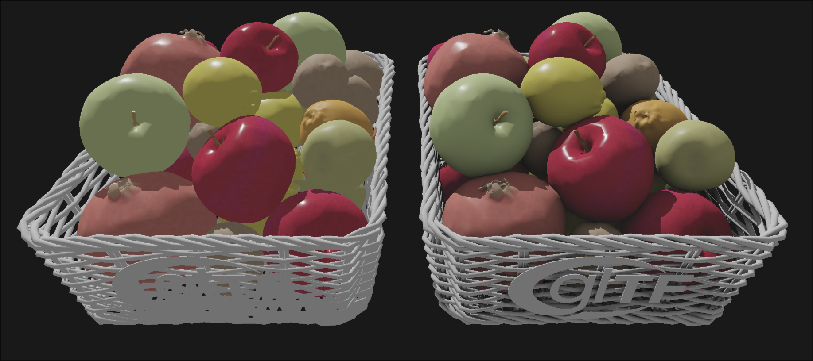

<div align="center">

# Rodan

### Real-Time Renderer built with Modern C++ and Vulkan

Rodan is a real-time rendering project focused on modern graphics programming, rendering architecture, and GPU systems.

Built on top of **Velos**, a custom Rendering Hardware Interface, Rodan explores production-oriented rendering techniques while maintaining clean, engine-like architecture.

<!-- Replace with your own screenshot -->


</div>

---

## Features

### Rendering
- Physically Based Rendering (PBR)
- glTF 2.0 scene loading
- Normal mapping
- Directional shadow mapping

### Engine Systems
- Scene graph
- Orbit + free camera controls
- Runtime asset loading
- Material system

### Velos RHI
- Vulkan backend
- Command buffer abstraction
- Pipeline & descriptor management
- Explicit resource transitions

---

## Screenshots

### Sponza


### Occlusion Textures


---

## Architecture

```text
Rodan Renderer
      ↓
Velos RHI
      ↓
Vulkan Backend
      ↓
GPU
```

---

## Building

### Requirements
- Linux
- C++23 compiler
- Vulkan SDK
- Premake5

### Build

```bash
git clone --recursive https://github.com/LipskiDev/Rodan.git
cd Rodan
premake5 gmake2
make -j$(nproc)
```

---

## Roadmap

- [x] PBR materials
- [x] Shadow mapping
- [x] glTF loading
- [ ] Skybox rendering
- [ ] Image Based Lighting (IBL)
- [ ] Compute pipelines
- [ ] GPU-driven rendering
- [ ] Frame graph

---

## Motivation

Rodan is a long-term graphics engineering project built to deepen expertise in:

- Real-time rendering
- GPU programming
- Engine architecture
- Graphics debugging & profiling
