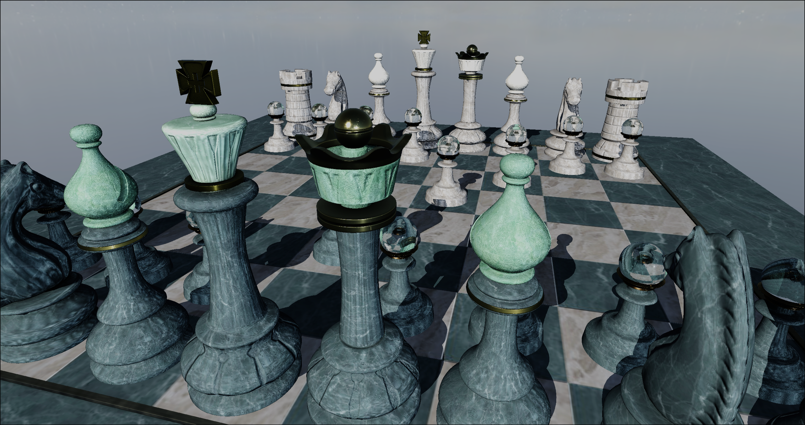
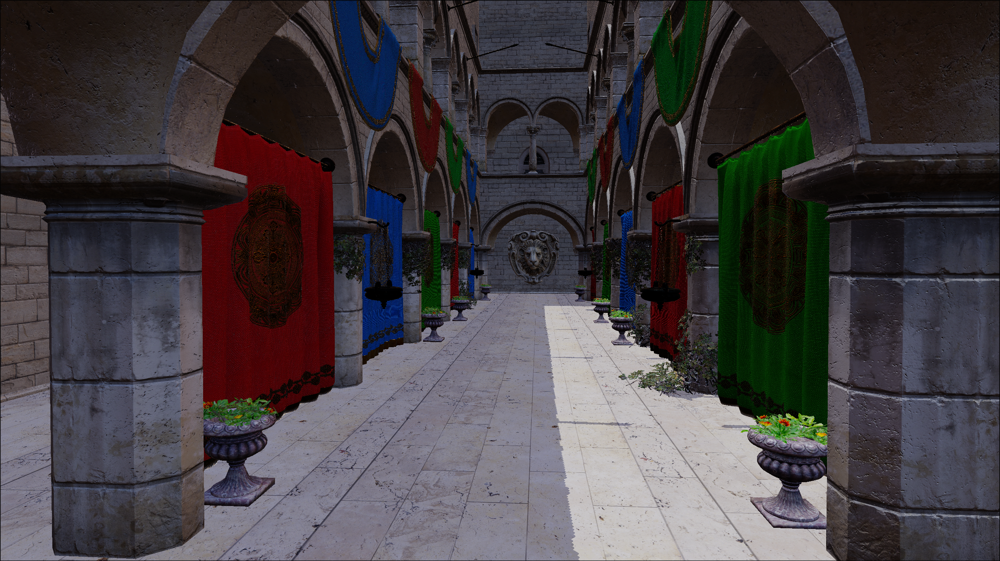
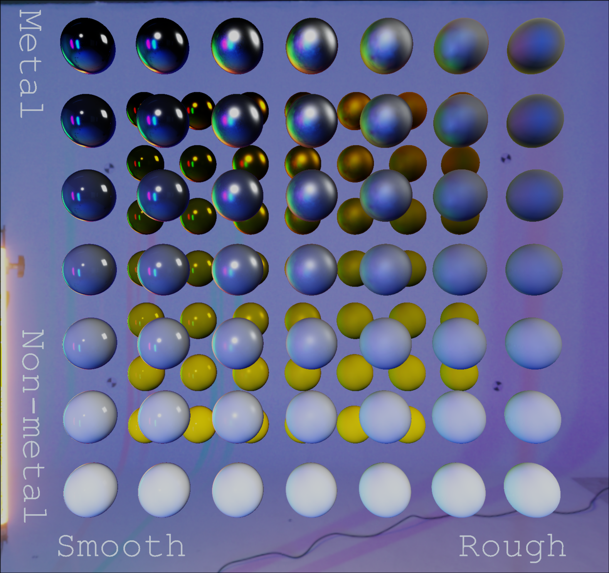
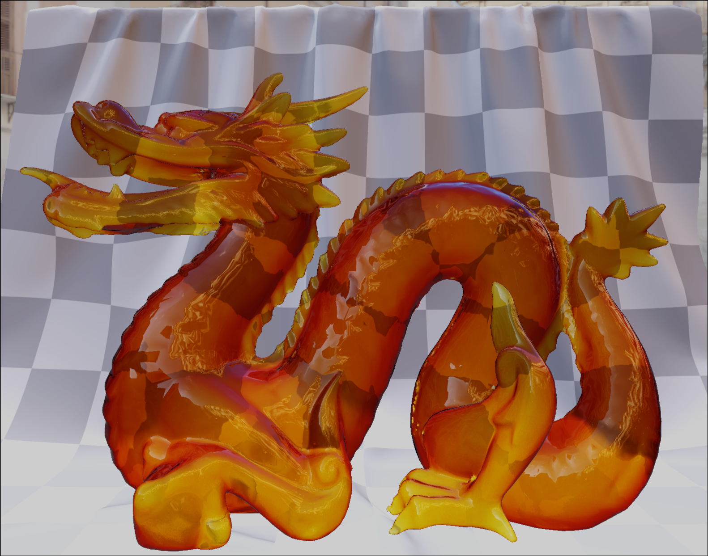

<div align="center">

# Rodan
### Real-Time Renderer · Modern C++ · Vulkan




</div>

---

## Features

- Physically Based Rendering (PBR) with Image Based Lighting (IBL)
- Skybox rendering from HDR environments
- Directional shadow mapping
- Tonemapping post-processing
- glTF 2.0 scene loading — KHR_materials_transmission, KHR_materials_volume
- Normal, occlusion & metallic/roughness textures
- Sorted render queues — opaque, alpha blend, transmission
- Compute pipeline support
- AABB bounding volumes with debug wireframe rendering
- Debug visualisation modes — Base Color, Normal, Metallic/Roughness, Tangent, Occlusion
- ImGui editor — scene loading, lights, camera, transforms, stats
- Custom Velos RHI — Vulkan backend, pipelines, descriptors, explicit resource transitions

---

## Screenshots






---

## Building

### Windows
```bash
git clone --recursive https://github.com/LipskiDev/Rodan.git
cd Rodan
premake5 vs2026
make -j$(nproc)
```

### Linux
```bash
git clone --recursive https://github.com/LipskiDev/Rodan.git
cd Rodan
premake5 gmake2
make -j$(nproc)
```

Requires a C++23 compiler, Vulkan SDK, and Premake5.

---

## Roadmap

- [x] Physically Based Rendering (PBR)
- [x] Image Based Lighting (IBL)
- [x] Directional shadow mapping
- [x] glTF 2.0 scene loading
- [x] Skybox rendering
- [x] Tonemapping post-processing
- [x] Transmission & volume materials (KHR extensions)
- [x] Sorted render queues
- [x] Compute pipelines
- [x] AABB bounding volumes & debug wireframes
- [x] Debug visualisation modes
- [x] ImGui editor
- [ ] Point & spot lights
- [ ] Cascaded shadow maps
- [ ] Screen Space Ambient Occlusion (SSAO)
- [ ] Bloom
- [ ] Frame graph
- [ ] GPU-driven rendering
